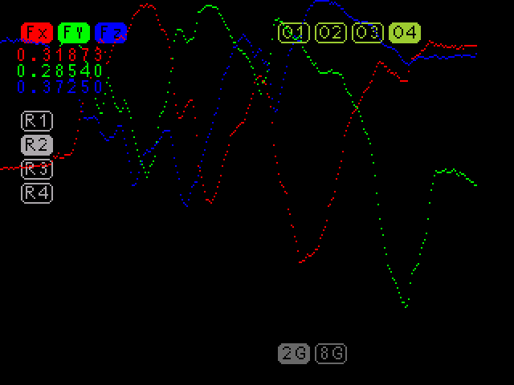

# QMC5883L LCD demo

This folder contains a demonstration program showcasing the functionality
of a magnetometer sensor using the STM32 F4VE board
and an LCD display included in the kit. The program features a straightforward
graphical user interface (GUI) for configuring sensor parameters.

## Overview

The demonstration program is designed to work with the STM32 F4VE development
board and a compatible LCD display. It provides a GUI interface to configure
sensor parameters such as Over Sample Rate, Output Data Rate and Full Scale
Range. The display includes buttons for enabling/disabling the display of
measurement (`Fx`, `Fy`, `Fz`). Additionally, there are buttons (`G2`, `G8`)
for controlling the full scale range. Yellow buttons (`O1`, `O2`, `O3`, `O4`)
control the over sample rate. Additionally, dim grey buttons labeled
 `R1` .. `R4` control the output data rate (10 Hz, 50 Hz, 100 Hz or 200 Hz
 corespondingly).

## Requirements

* STM32 F4VE development board
* Any QMC5883L module
* Compatible LCD display/touch panel included in the kit
* Development environment compatible with STM32F4 microcontrollers

## Setup

* Attach QMC5883L by I2C to PB9 (SDA), PB8 (SCL)
* Attach the LCD display to the designated port on the STM32F4VE board.
* Connect the STM32 F4VE board to your development environment.

## Usage

Compile and upload the program to the STM32 F4VE board. Upon successful upload,
the demonstration program will run, displaying sensor data on the LCD screen.
Activate the buttons on the GUI interface using the touch panel.
Simply touch the corresponding button on the LCD screen to toggle its state.
